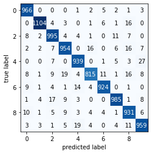

# Mnist
This model is an image classifier which classifies images of hand-written digits from 0-9 using Neural Network (Multilayer Perceptron)
This model is trained with Mnist dataset and uses Keras for building the Neural Network

# Required Libraries

    1. keras
    2. numpy
    3. matplotlib
    4. sklearn 
    5. os 
    6. pytz
    7. wandb (optional)
    
# Usage 
Play around with the hidden layer parameters, see if you can squeeze out more accuracy 
```
  model.add(Dense(num_classes, activation="relu"))        # Hidden layer
  model.add(Dense(500, activation="relu"))        # Hidden layer
  model.add(Dense(500, activation="relu"))        # Hidden layer
```

Manipulate index to see what the model got right or wrong. 
eg: index = incorrects[900] 
    index = corrects[5000]
```
index = incorrects[32]
digit = X_test[index]
label = y_test[index]
prediction = model.predict([[digit]])
draw_digit(digit)
```

There's also a confusion matrix if you're familiar with it




